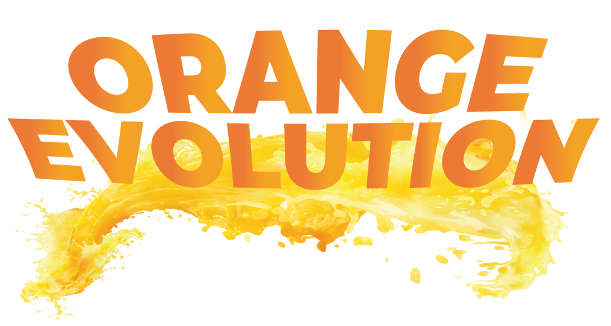

  <h1>Orange Evolution Web</h1>
  <h3>Um guia de desenvolvimento para seu start no mundo da tecnologia.</h3>
  <h2>
    <a href="https://orange-evolution-squad-31.vercel.app" alt="Ir para a plataforma">
      Acesse aqui
    </a>
  </h2>

  

## Descrição

O Orange Evolution consiste em trilhas totalmente gratuitas para que você possa iniciar a sua carreira na tecnologia. Você terá acesso a diversos conteúdos da Orange Juice, parceiros e de empresas de credibilidade, incluindo vídeos, lives, artigos, apostilas e até cursos gratuitos.

Esse projeto foi desenvolvido durante o Hackathon do [Programa de Formação][programa_formacao], oferecido pelo [Grupo FCamara][fcamara], junto à comunidade [Orange Juice][orange_juice].

## Layout

[Link do Figma](https://www.figma.com/file/bZqU5sy236WppUGslZ8lFr/Orange-Evolution---Squad-31---Design-UI?node-id=50%3A1346&t=C4B2x2LwQ1BA3MoL-1)

## API

Você pode conferir também o [repositório da API do projeto](https://github.com/hackatonfcamara-squad31/orange-evolution-api).

## Membros da Squad 31

<table>
  <tr>
    <td align="center">
      <a href="https://github.com/kevin-neves">
        
         
        
          <b>Kevin Jr. A. Neves</b>
        
      </a>
    </td>
    <td align="center">
      <a href="https://github.com/Leolucas12">
        
         
        
          <b>Leandro Gonçalves</b>
        
      </a>
    </td>
    <td align="center">
      <a href="https://www.linkedin.com/in/letcia-peixoto">
        
         
        
          <b>Letícia Peixoto</b>
        
      </a>
    </td>
    <td align="center">
      <a href="https://github.com/capelaum">
        
         
        
          <b>Luís V. Capelletto 
        
      </a>
    </td>
    <td align="center">
      <a href="https://github.com/RenataDellamatriz">
        
         
        
          <b>Renata Dellamatriz 
        
      </a>
    </td>
  </tr>
</table>

## Tech

- [Next.js][next]
- [Typescript][typescript]
- [Stitches][stitches]
- [Radix UI][radix]
- [React Hook Form][react_hook_form]
- [Zod][zod]
- [React-toastify][rect_toastify]
- [TanStack Query][react_query]
- [Zustand][zustand]
- [Axios][axios]
- [React Icons][react_icons]
- [React Loader Spinner][react_loader]
- [react-dropzone][react_dropzone]
- [cookies-next][cookies_next]

[fcamara]: https://www.fcamara.com.br
[orange_juice]: https://digital.fcamara.com.br/orangejuice
[programa_formacao]: https://digital.fcamara.com.br/programadeformacao
[next]: https://nextjs.org
[typescript]: https://www.typescriptlang.org
[stitches]: https://stitches.dev
[radix]: https://www.radix-ui.com
[react_hook_form]: https://react-hook-form.com
[zod]: https://zod.dev
[rect_toastify]: https://fkhadra.github.io/react-toastify/introduction
[react_query]: https://tanstack.com/query/v4/?from=reactQueryV3&original=https://react-query-v3.tanstack.com
[zustand]: https://github.com/pmndrs/zustand
[keen_slider]: https://keen-slider.io
[axios]: https://axios-http.com
[react_icons]: https://react-icons.github.io/react-icons
[react_loader]: https://www.npmjs.com/package/react-loader-spinner
[react_dropzone]: https://react-dropzone.js.org
[cookies_next]: https://www.npmjs.com/package/cookies-next
